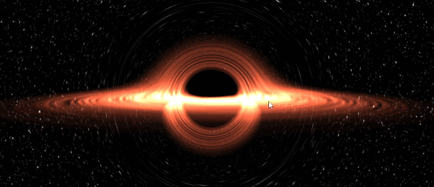

# Real-time Black Hole Based on WebGL
This is a real-time black hole visualization based on WebGL.

[Try it](https://shengzhiwu.github.io/kerr-black-hole.html) directly on my GitHub Page. Note that it has high GPU requirements. Even with state-of-the-art GPUs like the RTX 5090, if you're using a high-resolution display, we still recommend reducing the browser window size for smoother interaction.

